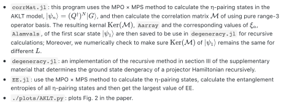

# Open Source Code

This respository contains all the source codes and original  data for Z. Yao,
L. Pan, S. Liu and P. Zhang, *Bounding Entanglement Entropy Using Zeros of
Local Correlation Matrices*, [arXiv:2201.07236
(2022)](https://arxiv.org/abs/2201.07236). If you have any question, please
email the corresponding author of the program.

## AKLT
<div align="center">  </div>

<!-- * `corrMat.jl`: this program uses the MPO × MPS method to calculate the -->
<!--   η-pairing states in the AKLT model, $|\psi_n⟩ = (Q^†)^N |G⟩$, and then -->
<!--   calculate the correlation matrix $\mathcal{M}$ of using pure range-3 operator -->
<!--   basis. The resulting kernal $\mathrm{Ker}(\mathcal{M})$, `Aarray` and the -->
<!--   corresponding values of $\xi_\alpha$, `Alamvals`, of the first scar state $| -->
<!--   \psi_1 \rangle$ are then saved to be use in `degeneracy.jl` for recursive -->
<!--   calculations; Moreover, we numerically check to make sure $\mathrm{Ker}(\mathcal{M})$ of -->
<!--   $|\psi_1 \rangle$ remains the same for different $L$. -->
<!-- * `degeneracy.jl`: an implementation of the recursive method in section III of -->
<!--   the supplementary material that determines the ground state dengeracy of a -->
<!--   projector Hamiltonian recursively. -->
<!-- * `EE.jl`: use the MPO × MPS method to calculate the η-pairing states, -->
<!--   calculate the entanglement entropies of all η-pairing states and then get the -->
<!--   largest value of EE. -->
<!-- * `./plots/AKLT.py`: plots Fig. 2 in the paper. -->

## PXP
### CorrMat
* `pxp.jl`: calculate the correlation spectrum of the scar states of the PXP
  model in the zero momentum and inversion symmetric sector, `(k, I)=0+`. To
  speed up the calculation, we use our fortran program to calculate the
  eigenstate of the PXP model to construct the correlation matrix.
* `corrSpectrum.py`: plot the correlation spectra to identity a starting point
  of $N_1$,
    - `plot(n)`: plot the correlation spectra of eigenstates surrounding
  an eigenstate indexed as $n$;
    - `plots(nList)`: plot the correlation spectra of eigenstates indexed
    `nList`;
* `plots/L20_E_sz.dat.html`: one can open this interactive html file to
  identify the eigenstate indices of the scar states in `(k, I)=0+` sector.
  This file is created by the python program `bokeh_Es_Sz.py` using the bokeh
  package.

### boundEE
* `boundEE.jl`: determine the EE upper bound. Refer to section V of the
  published paper for more details.
* `EEbound.md`: raw output from running `boundEE.jl` to make sure the $N_1$ we
  determined at least give local optimum EE upper bound.
* `plots/Es_EE_L20_m0.000_k=0+.dat`: eigenenergy--EE value of the scar states
  of the PXP-mZ model for `mass=0, L=20` in the `(k, I)=0+` sector. These data
  is calculated from my fortran program (not included in this respository).
* `plots/PXP.py`: plots Fig. 4 of the paper.

## Hubbard
* `corrMat.m`: uses the MPO × MPS method to caluclate the range-3 local correlation
  matrix of the Fermi-Hubbard model. From the kernal of the correlation matrix
  we can determine positive semidifinte Δ operators and projection operators,
  their random sum is stored in the file `Local_Operator_Rand.mat`;
* `KerProjH.m`: the original Matlab implementation of the recursive method for
  calculating the ground-state manifold of a projector Hamiltonian. After
  navigating Matlab to the `Hubbard` directory, run, e.g.
  ```matlab
  >> load('Local_Operator_Rand.mat')
  >> NSites_min = 4; NSites_max = 32;
  >> [Deg_OBC,Deg_PBC] = KerProjH(Local_Operator_Rand, 4, NSites_min, NSites_max)
  ```
  to get the ground-state dengeracy under both the PBC and OBC conditions for
  system size ranging from `NSites_min=4` to `NSites_max=32`.
* `plots/Hubbard.py`: plots Fig. S1 in the supplementary material.
